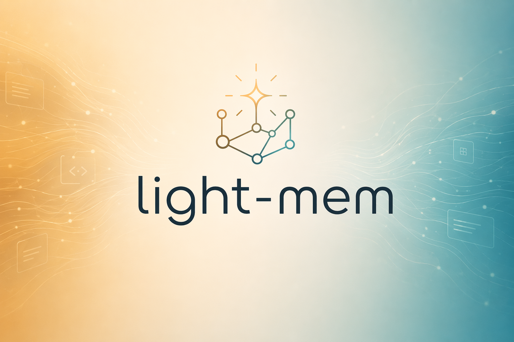

<p align="center">
  <a href="https://github.com/Ronald-Estacion_NordTech/light-mem">
    
  </a>
</p>

<h4 align="center">Lightweight persistent memory for <a href="https://claude.com/claude-code" target="_blank">Claude Code</a> and <a href="https://opencode.ai" target="_blank">OpenCode</a>.</h4>

<p align="center">
  <a href="LICENSE">
    
  </a>
  <a href="package.json">
    
  </a>
  <a href="package.json">
    
  </a>
</p>

<p align="center">
  <a href="#quick-start">Quick Start</a> •
  <a href="#how-it-works">How It Works</a> •
  <a href="#mcp-search-tools">Search Tools</a> •
  <a href="#documentation">Documentation</a> •
  <a href="#configuration">Configuration</a> •
  <a href="#troubleshooting">Troubleshooting</a> •
  <a href="#license">License</a>
</p>

<p align="center">
  Light-Mem seamlessly preserves context across sessions by automatically capturing tool usage observations, generating semantic summaries, and making them available to future sessions. Works with <strong>Claude Code</strong> via lifecycle hooks and with <strong>OpenCode</strong> via a plugin installed into <code>~/.config/opencode/plugins</code> — both editors POST to the same shared worker.
</p>

---

## Quick Start

Install with a single command:

```bash
npx light-mem install
```

Or install from the plugin marketplace inside Claude Code:

```bash
/plugin marketplace add light-mem/light-mem

/plugin install light-mem
```

Restart Claude Code. Context from previous sessions will automatically appear in new sessions.

> **Note:** Light-Mem is also published on npm, but `npm install -g light-mem` installs the **SDK/library only** — it does not register the plugin hooks or set up the worker service. Always install via `npx light-mem install` or the `/plugin` commands above.

**Key Features:**

- 🧠 **Persistent Memory** - Context survives across sessions
- 🖥️ **Claude Code + OpenCode** - Works with both editors; OpenCode support resurrected in this release
- 📊 **Progressive Disclosure** - Layered memory retrieval with token cost visibility
- 🔍 **Skill-Based Search** - Query your project history with mem-search skill
- 🌐 **Web Viewer UI** - Real-time memory stream on the worker port (run `npx light-mem status` to see the URL)
- 🔒 **Privacy Control** - Use `<private>` tags to exclude sensitive content from storage
- ⚙️ **Context Configuration** - Fine-grained control over what context gets injected
- 🤖 **Automatic Operation** - No manual intervention required
- 🔗 **Citations** - Reference past observations with IDs (access via `/api/observation/{id}` on the worker port, or view all in the web viewer)
- 🧪 **Beta Channel** - Try experimental features like Endless Mode via version switching

---

## Documentation

📚 **[View Full Documentation](https://github.com/Ronald-Estacion_NordTech/light-mem/)** - Browse on GitHub

### Getting Started

- **[Installation Guide](https://github.com/Ronald-Estacion_NordTech/light-mem/installation)** - Quick start & advanced installation
- **[Usage Guide](https://github.com/Ronald-Estacion_NordTech/light-mem/usage/getting-started)** - How Light-Mem works automatically
- **[Search Tools](https://github.com/Ronald-Estacion_NordTech/light-mem/usage/search-tools)** - Query your project history with natural language
- **[Beta Features](https://github.com/Ronald-Estacion_NordTech/light-mem/beta-features)** - Try experimental features like Endless Mode

### Best Practices

- **[Context Engineering](https://github.com/Ronald-Estacion_NordTech/light-mem/context-engineering)** - AI agent context optimization principles
- **[Progressive Disclosure](https://github.com/Ronald-Estacion_NordTech/light-mem/progressive-disclosure)** - Philosophy behind Light-Mem's context priming strategy

### Architecture

- **[Overview](https://github.com/Ronald-Estacion_NordTech/light-mem/architecture/overview)** - System components & data flow
- **[Architecture Evolution](https://github.com/Ronald-Estacion_NordTech/light-mem/architecture-evolution)** - The journey from v3 to v5
- **[Hooks Architecture](https://github.com/Ronald-Estacion_NordTech/light-mem/hooks-architecture)** - How Light-Mem uses lifecycle hooks
- **[Hooks Reference](https://github.com/Ronald-Estacion_NordTech/light-mem/architecture/hooks)** - 7 hook scripts explained
- **[Worker Service](https://github.com/Ronald-Estacion_NordTech/light-mem/architecture/worker-service)** - Node HTTP daemon & process management
- **[Database](https://github.com/Ronald-Estacion_NordTech/light-mem/architecture/database)** - `node:sqlite` schema & FTS5 search
- **[Search Architecture](https://github.com/Ronald-Estacion_NordTech/light-mem/architecture/search-architecture)** - In-process hybrid search (potion-base-8M + BM25)

### Configuration & Development

- **[Configuration](https://github.com/Ronald-Estacion_NordTech/light-mem/configuration)** - Environment variables & settings
- **[Development](https://github.com/Ronald-Estacion_NordTech/light-mem/development)** - Building, testing, contributing
- **[Troubleshooting](https://github.com/Ronald-Estacion_NordTech/light-mem/troubleshooting)** - Common issues & solutions

---

## How It Works

**Core Components:**

1. **Lifecycle Hooks (Claude Code)** - Setup, SessionStart, UserPromptSubmit, PreToolUse, PostToolUse, Stop
2. **OpenCode Plugin** - Installed into `~/.config/opencode/plugins`; POSTs session events to the same worker HTTP endpoints
3. **Smart Install** - Cached dependency checker run on the Setup hook
4. **Worker Service** - Node HTTP daemon (per-user port `37700 + uid%100`) with web viewer UI and search endpoints
5. **SQLite Database** - Built-in `node:sqlite`; stores sessions, observations, summaries
6. **mem-search Skill** - Natural language queries with progressive disclosure
7. **In-process Embeddings** - potion-base-8M + BM25 hybrid search (no external vector DB)

See [Architecture Overview](https://github.com/Ronald-Estacion_NordTech/light-mem/architecture/overview) for details.

---

## MCP Search Tools

Light-Mem provides intelligent memory search through **4 MCP tools** following a token-efficient **3-layer workflow pattern**:

**The 3-Layer Workflow:**

1. **`search`** - Get compact index with IDs (~50-100 tokens/result)
2. **`timeline`** - Get chronological context around interesting results
3. **`get_observations`** - Fetch full details ONLY for filtered IDs (~500-1,000 tokens/result)

**How It Works:**
- Claude uses MCP tools to search your memory
- Start with `search` to get an index of results
- Use `timeline` to see what was happening around specific observations
- Use `get_observations` to fetch full details for relevant IDs
- **~10x token savings** by filtering before fetching details

**Available MCP Tools:**

1. **`search`** - Search memory index with full-text queries, filters by type/date/project
2. **`timeline`** - Get chronological context around a specific observation or query
3. **`get_observations`** - Fetch full observation details by IDs (always batch multiple IDs)

**Example Usage:**

```typescript
// Step 1: Search for index
search(query="authentication bug", type="bugfix", limit=10)

// Step 2: Review index, identify relevant IDs (e.g., #123, #456)

// Step 3: Fetch full details
get_observations(ids=[123, 456])
```

See [Search Tools Guide](https://github.com/Ronald-Estacion_NordTech/light-mem/usage/search-tools) for detailed examples.

---

## Beta Features

Light-Mem offers a **beta channel** with experimental features like **Endless Mode** (biomimetic memory architecture for extended sessions). Switch between stable and beta versions from the web viewer UI → Settings.

See **[Beta Features Documentation](https://github.com/Ronald-Estacion_NordTech/light-mem/beta-features)** for details on Endless Mode and how to try it.

---

## System Requirements

- **Node.js**: 24.0.0 or higher (required — uses the built-in `node:sqlite` module)
- **Claude Code**: Latest version with plugin support
- **C++20 toolchain**: for compiling tree-sitter native grammars at install (the Setup hook
  passes `CXXFLAGS=-std=c++20`)
- **SQLite**: provided by Node's built-in `node:sqlite` — no separate install

> No Bun, no Python/uv, and no external vector database are required. Embeddings run
> in-process (potion-base-8M) and storage is the built-in `node:sqlite`.

---
### Windows Setup Notes

If you see an error like:

```powershell
npm : The term 'npm' is not recognized as the name of a cmdlet
```

Make sure Node.js and npm are installed and added to your PATH. Download the latest Node.js installer from https://nodejs.org and restart your terminal after installation.

---

## Configuration

Settings are managed in `~/.light-mem/settings.json` (auto-created with defaults on first run). Configure AI model, worker port, data directory, log level, and context injection settings.

See the **[Configuration Guide](https://github.com/Ronald-Estacion_NordTech/light-mem/configuration)** for all available settings and examples.

### Mode Configuration

Light-Mem supports multiple workflow modes via the `LIGHT_MEM_MODE` setting.

#### How to Configure

Edit your settings file at `~/.light-mem/settings.json`:

```json
{
  "LIGHT_MEM_MODE": "code"
}
```

Modes are defined in `plugin/modes/`. To see all available modes locally:

```bash
ls ~/.claude/plugins/marketplaces/light-mem/plugin/modes/
```

#### Available Modes

| Mode | Description |
|------------|-------------------------|
| `code` | Default mode |
| `chill` | Relaxed observation cadence |
| `investigation` | Deep-dive investigation mode |

#### After Changing Mode

Restart Claude Code to apply the new mode configuration.

---

## Development

See the **[Development Guide](https://github.com/Ronald-Estacion_NordTech/light-mem/development)** for build instructions, testing, and contribution workflow.

---

## Troubleshooting

If experiencing issues, describe the problem to Claude and the troubleshoot skill will automatically diagnose and provide fixes.

See the **[Troubleshooting Guide](https://github.com/Ronald-Estacion_NordTech/light-mem/troubleshooting)** for common issues and solutions.

---

## Bug Reports

Create comprehensive bug reports with the automated generator:

```bash
cd ~/.claude/plugins/marketplaces/light-mem
npm run bug-report
```

## Contributing

Contributions are welcome! Please:

1. Fork the repository
2. Create a feature branch
3. Make your changes with tests
4. Update documentation
5. Submit a Pull Request

See [Development Guide](https://github.com/Ronald-Estacion_NordTech/light-mem/development) for contribution workflow.

---

## License

Light-Mem is licensed under the Apache License 2.0.

We chose Apache-2.0 because durable agentic memory should be easy to embed in
developer tools, local agents, MCP servers, enterprise systems, and production
agent harnesses.

See the [LICENSE](LICENSE) file for full details.

---

## Support

- **Documentation**: [docs/](docs/)
- **Issues**: [GitHub Issues](https://github.com/Ronald-Estacion_NordTech/light-mem/issues)
- **Repository**: [github.com/Ronald-Estacion_NordTech/light-mem](https://github.com/Ronald-Estacion_NordTech/light-mem)
- **Author**: Ronald Estacion ([@Ronald-Estacion_NordTech](https://github.com/Ronald-Estacion_NordTech))

---

**Built with Claude Agent SDK** | **Works with Claude Code** | **Made with TypeScript**
