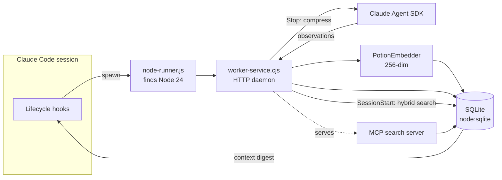
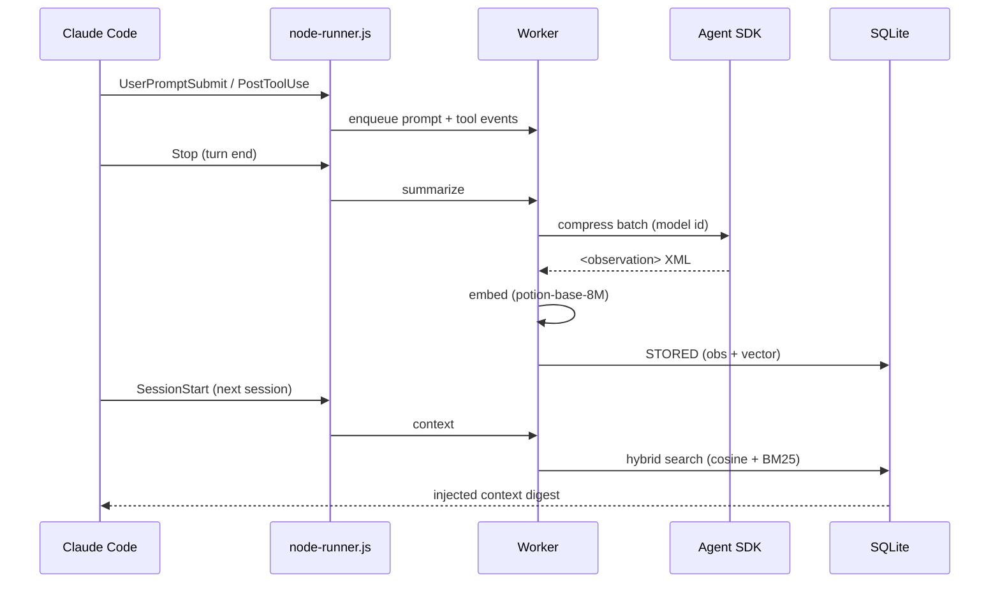
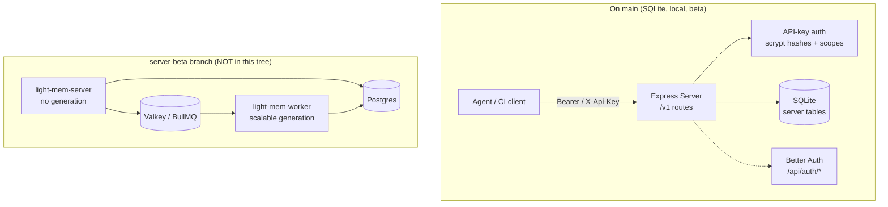

# Architecture

<!-- START:OVERVIEW -->
light-mem gives Claude Code and OpenCode persistent memory across sessions.

Six lifecycle hooks (declared in `plugin/hooks/hooks.json`) fire during a Claude Code
session. Each hook launches `plugin/scripts/node-runner.js` — a small ES-module launcher
that locates a Node ≥24 and re-spawns the bundled worker (`worker-service.cjs`) under it.
OpenCode is supported via a plugin (`src/integrations/opencode-plugin`) installed into
`~/.config/opencode/plugins` that POSTs session events to the same worker HTTP endpoints.
The worker is a long-running HTTP daemon that owns the SQLite database and an MCP search server.

The data loop is **capture → compress → embed → store → recall**:
1. `UserPromptSubmit`/`PreToolUse`/`PostToolUse` enqueue raw prompt + tool events.
2. On `Stop`, the worker spawns the Claude Agent SDK to compress the batch into structured
   `<observation>` records (title, facts, concepts, files).
3. Each observation/prompt is embedded in-process with potion-base-8M (256-dim static
   embeddings) and stored in SQLite alongside FTS5 indexes.
4. On `SessionStart`, the worker runs hybrid search (cosine + BM25, reciprocal-rank fusion)
   over past memory and injects a compact context digest into the new session.

The runtime needs only Node ≥24 — no Bun, no Python/uv, no external vector database. SQLite
uses the built-in `node:sqlite` module (unflagged in Node 24).
<!-- END:OVERVIEW -->

<!-- START:COMPONENTS -->
- **Hook launcher** — `plugin/scripts/node-runner.js`. ES module; finds a Node ≥24
  (current process, else nvm scan, else known paths/PATH) and re-spawns the worker.
- **Worker service** — `src/services/worker/` → bundled to `plugin/scripts/worker-service.cjs`.
  HTTP daemon: enqueues hook payloads, runs the SDK compression loop, serves `/health`
  and the web viewer.
- **Claude provider** — `src/services/worker/ClaudeProvider.ts`. Spawns the Agent SDK with
  an isolated env (`src/shared/EnvManager.ts`) and the resolved model id
  (`getModelId` → `resolveTierAlias`, `src/services/worker/model-aliases.ts`).
- **Embedder** — `src/services/embed/PotionEmbedder.ts` + `WordPieceTokenizer.ts`.
  In-process model2vec (potion-base-8M); model assets in `src/models/potion-base-8m/`.
- **Vector store** — `src/services/sync/LocalVectorStore.ts`. `vectors` table + hybrid
  RRF search; embeddings stored as BLOBs (256 float32 = 1024 bytes).
- **SQLite layer** — `src/services/sqlite/`. `node-sqlite-compat.ts` wraps the built-in
  `node:sqlite` `DatabaseSync` with a bun:sqlite-compatible surface.
- **MCP search server** — `plugin/scripts/mcp-server.cjs`. Exposes `search`, `timeline`,
  `get_observations`, and smart code-search tools to Claude.
- **npx CLI / installer** — `src/npx-cli/`. `install`, `repair`, `doctor`, runtime commands.
- **Build** — `scripts/build-hooks.js` (esbuild bundle + Rule A canonical-template verify)
  and `scripts/sync-plugin-manifests.js` (version propagation).
<!-- END:COMPONENTS -->

<!-- START:DEPENDENCIES -->
- **Runtime:** Node ≥24 only. No Bun, no uv/Python, no Chroma. SQLite via `node:sqlite`.
- **Claude Agent SDK** (`@anthropic-ai/claude-agent-sdk`) for observation compression —
  authenticated via OAuth keychain token, Direct API key, gateway, or AWS Bedrock
  (`CLAUDE_CODE_USE_BEDROCK=1`). Model id must be provider-valid.
- **MCP SDK** (`@modelcontextprotocol/sdk`) for the search server.
- **tree-sitter** native grammars (smart code search) — compiled at install; needs a
  C++20 toolchain under Node 24 (the Setup hook passes `CXXFLAGS=-std=c++20`).
- **Storage:** `~/.light-mem/` — `light-mem.db` (SQLite), `logs/`, `settings.json`, `.env`.
- The worker HTTP port is derived per-user: `37700 + (uid % 100)` (not a fixed port).
<!-- END:DEPENDENCIES -->

<!-- START:DIAGRAM_OVERVIEW -->

<!-- END:DIAGRAM_OVERVIEW -->

<!-- START:DIAGRAM_DATA_FLOW -->

<!-- END:DIAGRAM_DATA_FLOW -->

<!-- START:SERVER_RUNTIME -->
light-mem ships a second, **multi-tenant server runtime** alongside the default worker. It
is selected by `LIGHT_MEM_RUNTIME` in `~/.light-mem/settings.json` (default `worker`,
`src/npx-cli/commands/install.ts`). The HTTP layer is a shared Express 5 `Server` class
(`src/services/server/Server.ts`) that both runtimes reuse; the server runtime additionally
enables security headers.

**On `main` the server runtime is SQLite-backed and local-only.** The v1 HTTP API
(`src/server/routes/v1/ServerV1Routes.ts`) exposes projects, sessions, events, memories,
`/v1/search`, `/v1/context`, and `/v1/audit`, persisted to server-owned SQLite tables
(`src/storage/sqlite/schema.ts` — `projects`, `server_sessions`, `agent_events`,
`memory_items`, `api_keys`, `audit_log`, `teams`, …). Auth is API-key based
(`src/server/middleware/auth.ts`): a `Bearer`/`X-Api-Key` key validated against scrypt-salted
hashes (`src/server/auth/sqlite-api-key-service.ts`), with per-route scope enforcement
(`memories:read` / `memories:write`). A parallel Better Auth integration
(`@better-auth/api-key` + organization/teams) is wired at `ALL /api/auth/*`
(`src/server/auth/auth.ts`, `BetterAuthRoutes.ts`) for the future multi-tenant key UX.

**Not on `main` (server-beta branch `server-beta-phase-4-event-pipeline`):** the
Postgres + Valkey/BullMQ runtime, its Docker compose stack (`postgres`, `valkey`,
`light-mem-server`, scalable `light-mem-worker`), the Postgres storage layer
(`src/storage/postgres/`), and Postgres auth middleware are documented in
`docs/server.md` / `docs/server-beta-architecture-and-team-vision.md` but are **not present
in this working tree**. The release-readiness audit marks that branch "ready to ship with
deferred items"; it has not merged to `main`.

**Current limitations to know:** the `npx light-mem install --runtime server` flag is **not
yet enforced** — `src/npx-cli/index.ts` rejects any `--runtime` other than `worker`. The
`npx light-mem server <cmd>` subcommands exist but several are marked "not yet implemented".
Treat the server runtime as **beta**; the worker runtime is the supported default.
<!-- END:SERVER_RUNTIME -->

<!-- START:DIAGRAM_SERVER_RUNTIME -->

<!-- END:DIAGRAM_SERVER_RUNTIME -->
